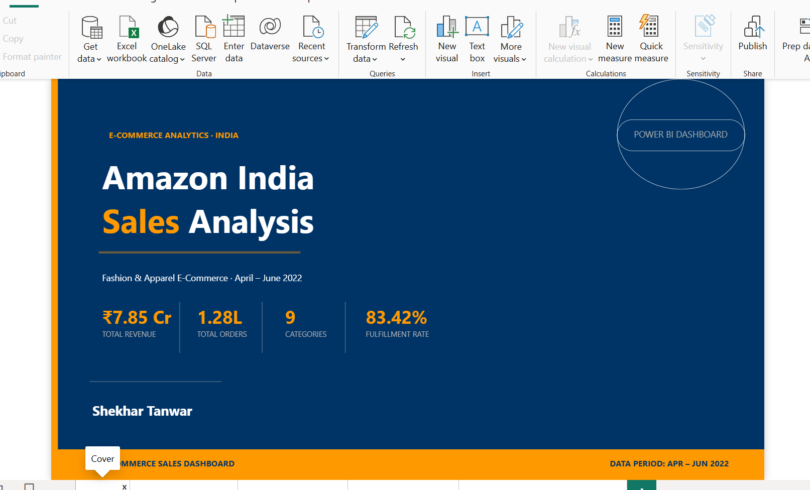
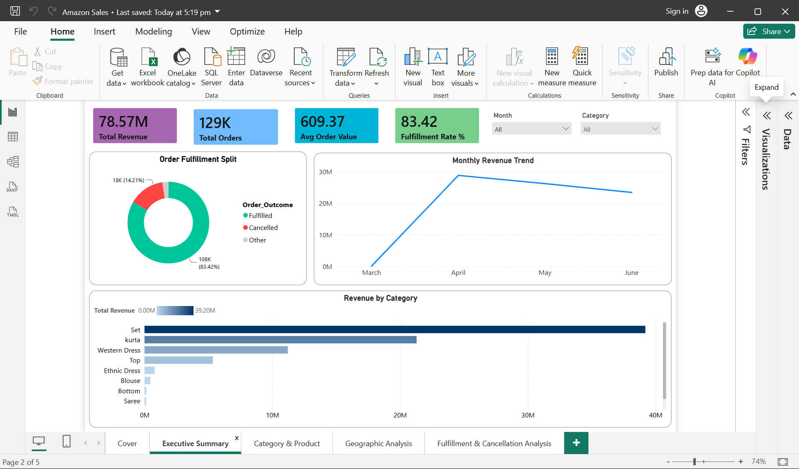
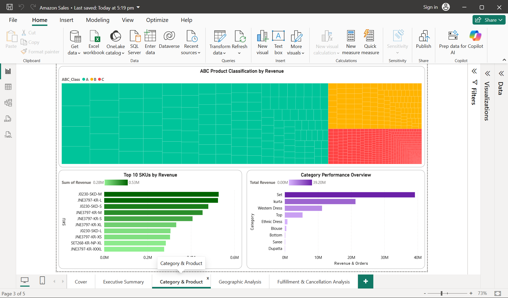
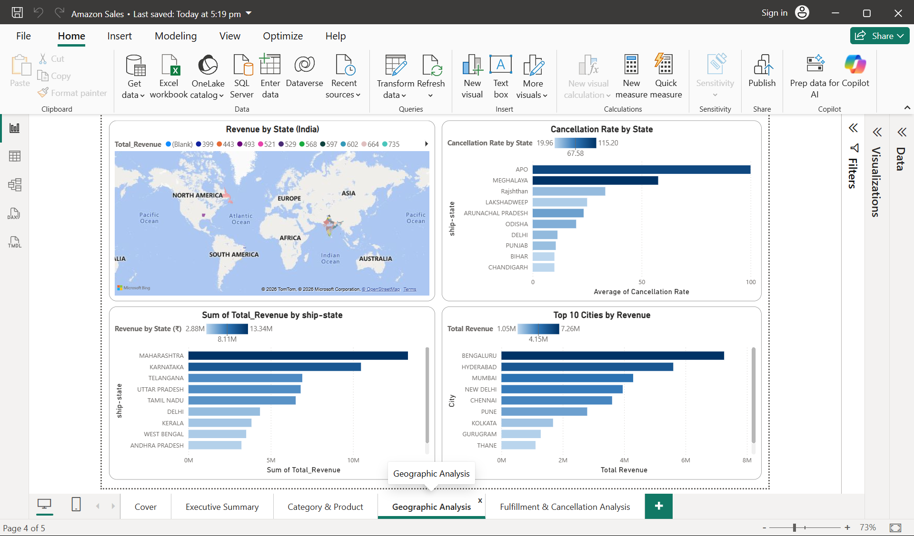
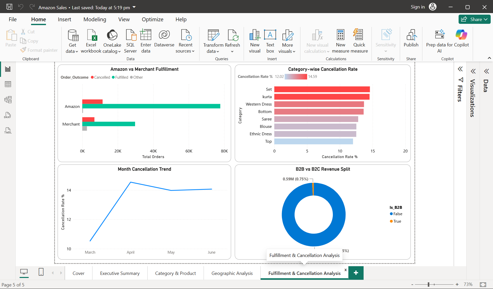

# 🛒 Amazon India Sales Analysis Dashboard


> An end-to-end E-Commerce Analytics project analyzing **1,28,942 Amazon India orders worth ₹7.85 Crore** using Python (Pandas, NumPy) and Power BI — covering sales trends, ABC classification, geographic analysis, and fulfillment performance.

---

## 📌 Project Overview

This project builds a complete data analytics pipeline for Amazon India's Fashion & Apparel category (Apr–Jun 2022):

- **Python** for data cleaning, EDA, and ABC SKU classification
- **Power BI** for an interactive 5-page business intelligence dashboard
- **DAX** for custom KPI measures (AOV, Fulfillment Rate, Cancellation Rate)

---

## 🎯 Key Business Insights

| Metric | Value |
|--------|-------|
| 💰 Total Revenue | ₹7.85 Crore (Apr–Jun 2022) |
| 📦 Total Orders | 1,28,942 orders |
| 🛍️ Average Order Value | ₹648.57 |
| ✅ Fulfilled Orders | 1,07,558 (83.4%) |
| ❌ Cancelled Orders | 18,325 (14.21%) |
| 🏆 Top Category | Set — ₹3.92 Cr (49.9% of revenue) |
| 🔑 Class-A SKUs | 1,324 SKUs → 70% of total revenue |
| 🗺️ Top State | Maharashtra — ₹1.33 Cr |
| 🏙️ Top City | Bengaluru — ₹68.5 Lakh |
| 🚚 Amazon FBA | 12.79% cancellation rate |
| 🏪 Merchant Fulfilled | 17.47% cancellation rate |
| 🏢 B2B vs B2C | 99.25% B2C orders |

---

## 📊 Dashboard Preview

### Page 1 — Cover


### Page 2 — Executive Summary


### Page 3 — Category & Product Analysis


### Page 4 — Geographic Analysis


### Page 5 — Fulfillment & Cancellation


---

## 📈 Analysis Workflow

```
Raw Data (1,28,942 rows — Amazon Sale Report.csv)
                    ↓
     Python Data Cleaning (Pandas)
     ├── Removed nulls & duplicates
     ├── Parsed dates & derived Month, Week, Day_of_Week
     └── Created Revenue & Order_Outcome columns
                    ↓
     Exploratory Data Analysis (EDA)
     ├── Monthly revenue trends (Apr > May > June)
     ├── Category-wise revenue breakdown
     ├── State & City revenue distribution (28+ states)
     └── Fulfillment & Cancellation analysis
                    ↓
     ABC Classification (SKU Level)
     ├── Class A → 1,324 SKUs → ₹5.50 Cr (70% revenue)
     ├── Class B → 1,770 SKUs → ₹1.57 Cr (20% revenue)
     └── Class C → 4,063 SKUs → ₹0.79 Cr (10% revenue)
                    ↓
     5 CSV Files Exported for Power BI
                    ↓
     Power BI Dashboard (5 Interactive Pages)
```

---

## 🏷️ Revenue by Category

| Category | Revenue | Orders | Share |
|----------|---------|--------|-------|
| Set | ₹3.92 Cr | 47,031 | 49.9% |
| Kurta | ₹2.13 Cr | 46,700 | 27.1% |
| Western Dress | ₹1.12 Cr | 14,703 | 14.3% |
| Top | ₹53.5 Lakh | 10,163 | 6.8% |
| Ethnic Dress | ₹7.9 Lakh | 1,093 | 1.0% |
| Others | ₹7.3 Lakh | 1,459 | 0.9% |

---

## 🗺️ Top 10 States by Revenue

| Rank | State | Revenue | Orders |
|------|-------|---------|--------|
| 1 | Maharashtra | ₹1.33 Cr | 21,073 |
| 2 | Karnataka | ₹1.05 Cr | 16,394 |
| 3 | Telangana | ₹69.2 Lakh | 10,637 |
| 4 | Uttar Pradesh | ₹68.2 Lakh | 9,947 |
| 5 | Tamil Nadu | ₹65.2 Lakh | 10,809 |
| 6 | Delhi | ₹42.4 Lakh | 6,393 |
| 7 | Kerala | ₹38.3 Lakh | 6,151 |
| 8 | West Bengal | ₹35.1 Lakh | 5,547 |
| 9 | Andhra Pradesh | ₹32.2 Lakh | 5,055 |
| 10 | Haryana | ₹28.8 Lakh | 4,188 |

---

## 🏙️ Top 10 Cities by Revenue

| Rank | City | Revenue |
|------|------|---------|
| 1 | Bengaluru | ₹68.5 Lakh |
| 2 | Hyderabad | ₹49.5 Lakh |
| 3 | Mumbai | ₹37.0 Lakh |
| 4 | New Delhi | ₹36.1 Lakh |
| 5 | Chennai | ₹31.0 Lakh |
| 6 | Pune | ₹23.4 Lakh |
| 7 | Kolkata | ₹14.1 Lakh |
| 8 | Gurugram | ₹12.2 Lakh |
| 9 | Thane | ₹10.0 Lakh |
| 10 | Lucknow | ₹9.3 Lakh |

---

## 🔑 ABC Classification Results

| Class | SKUs | Revenue | Contribution |
|-------|------|---------|-------------|
| A (Critical) | 1,324 | ₹5.50 Cr | 70% |
| B (Important) | 1,770 | ₹1.57 Cr | 20% |
| C (Low Priority) | 4,063 | ₹0.79 Cr | 10% |
| **Total** | **7,157** | **₹7.85 Cr** | **100%** |

> **Business Implication:** Focus inventory & marketing spend on 1,324 Class-A SKUs to protect 70% of revenue.

---

## 🚚 Fulfillment Analysis

| Fulfillment Type | Cancellation Rate |
|-----------------|------------------|
| Amazon FBA | 12.79% |
| Merchant Fulfilled | 17.47% |
| **Overall** | **14.21%** |

> **Key Finding:** Amazon FBA has 4.68% lower cancellation rate — suggests better logistics reliability vs merchant fulfillment.

---

## 📊 Dashboard Pages

| Page | Content |
|------|---------|
| 1️⃣ Cover | Project overview & key stats |
| 2️⃣ Executive Summary | KPI cards, monthly revenue trend, category revenue, order outcomes |
| 3️⃣ Category & Product | ABC Treemap, Top 10 SKUs by revenue, size distribution |
| 4️⃣ Geographic Analysis | State & city-wise revenue map, cancellation hotspots |
| 5️⃣ Fulfillment & Cancellation | Amazon vs Merchant, B2B vs B2C split, cancellation trends |

---

## 📂 Project Structure

```
amazon-india-sales-analysis/
│
├── Amazon Sales Analysis.ipynb     ← Python EDA & ABC Analysis
├── Amazon Sales.pbix               ← Power BI Dashboard (5 pages)
├── README.md
│
├── data/
│   ├── powerbi_main_data.csv       ← 1,28,942 cleaned transactions
│   ├── powerbi_category_summary.csv ← Category-wise aggregation
│   ├── powerbi_state_summary.csv   ← State-wise sales + cancellation
│   └── sku_abc_classification.csv  ← 7,157 SKUs with ABC class
│
└── screenshots/
    ├── 01_cover.png
    ├── 02_executive_summary.png
    ├── 03_category_product.png
    ├── 04_geographic_analysis.png
    └── 05_fulfillment_analysis.png
```

---

## 🛠️ Tools & Technologies

| Tool | Purpose |
|------|---------|
| Python 3 (Pandas, NumPy) | Data cleaning, EDA, ABC Classification |
| Jupyter Notebook | Analysis environment |
| Power BI Desktop | 5-page interactive dashboard |
| DAX | Custom KPI measures (AOV, Fulfillment Rate %) |

---

## 📦 Dataset

- **Source:** [Amazon Sale Report — Kaggle](https://www.kaggle.com/datasets/thedevastator/unlock-profits-with-e-commerce-sales-data)
- **Period:** April – June 2022
- **Rows:** 1,28,942 orders
- **Columns:** 25 (Order ID, Date, Status, Category, SKU, Revenue, State, City, B2B, etc.)
- **Categories:** 9 (Kurta, Set, Western Dress, Top, Blouse, Bottom, Saree, Ethnic Dress, Dupatta)
- **Coverage:** Pan-India (28+ states, 100+ cities)

---

## 🚀 How To Run

### Step 1 — Clone the repository
```bash
git clone https://github.com/shekhu24-bit/amazon-india-sales-analysis.git
cd amazon-india-sales-analysis
```

### Step 2 — Install dependencies
```bash
pip install pandas numpy jupyter
```

### Step 3 — Download dataset
Download from [Kaggle](https://www.kaggle.com/datasets/thedevastator/unlock-profits-with-e-commerce-sales-data) and place `Amazon Sale Report.csv` in project root

### Step 4 — Run notebook
```bash
jupyter notebook "Amazon Sales Analysis.ipynb"
```

### Step 5 — Open Power BI Dashboard
Open `Amazon Sales.pbix` in Power BI Desktop → Click **Home → Refresh**

---

## 💼 Business Applications

- 📌 E-Commerce Sales Performance Monitoring
- 📌 Inventory Optimization using ABC Classification
- 📌 Geographic Market Expansion Planning
- 📌 Fulfillment Strategy Evaluation (FBA vs Merchant)
- 📌 Category & SKU-level Revenue Analysis

---

## 📚 Skills Demonstrated

- Data Cleaning & Feature Engineering (Pandas)
- Exploratory Data Analysis (EDA)
- ABC Inventory Classification
- Geographic Sales Analysis
- Fulfillment & Cancellation Analytics
- Power BI Dashboard Development (5 pages)
- DAX Measures & KPI Design
- Business Insight Generation

---

## 🏆 Conclusion

This project demonstrates how Python-based analytics and Power BI dashboards can transform raw e-commerce transaction data into actionable business insights. The ABC classification reveals that just **1,324 SKUs (18.5%)** drive **70% of revenue** — a critical finding for inventory and marketing strategy. Maharashtra and Bengaluru emerge as top markets, while Amazon FBA shows significantly better fulfillment performance than merchant-fulfilled orders.

---

## 👤 Author

**Shekhar Tanwar**
MBA — Finance & Business Analytics | Maharshi Dayanand University, Rohtak

[](https://www.linkedin.com/in/shekhar-tanwar-33b7a7322)
[](https://github.com/shekhu24-bit)